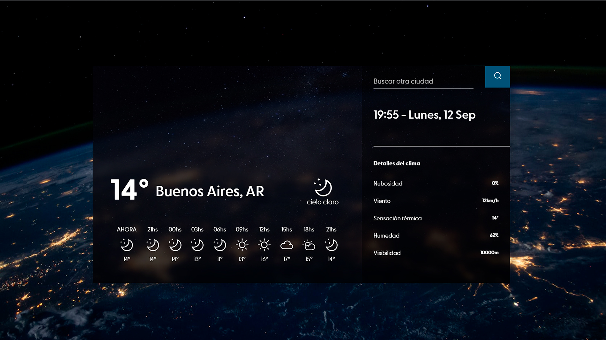

# Clima-App project in ReactJS

Proyecto de aplicación web de clima, que permite buscar y ver el clima en vivo de la ciudad deseada de cualquier parte del mundo.


## Ver [DEMO](https://clima-deluca.netlify.app)


## Instalación

Este proyecto requiere [NodeJS](https://nodejs.org/) para su ejecución.

```bash
git clone https://github.com/facudeluca/clima-app
cd clima
npm install
npm start
```